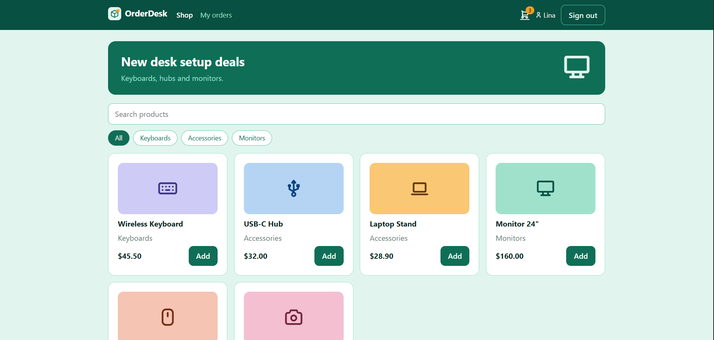
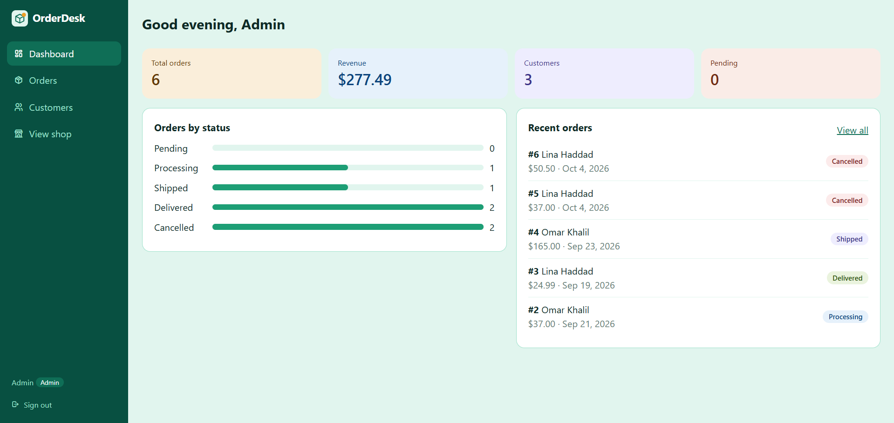

# OrderDesk


A full-stack order management app. Customers sign up, browse products, place orders and track them. Staff and admins manage orders and customers from a dashboard.




## Features

**Customers**

- Sign up and sign in
- Browse and search products, filter by category
- Cart (saved in the browser) and checkout
- Order tracking with live status updates (polls every 15 seconds)
- Cancel an order while it is still pending

**Staff and admins**

- Dashboard with revenue, order counts and orders by status
- Search and filter orders, update their status
- Customer list with order history and total spent
- Admins can delete orders and create staff accounts

## Tech stack

| Layer    | Tools                                 |
| -------- | ------------------------------------- |
| Frontend | React, TypeScript, Vite, React Router |
| Backend  | Node.js, Express, TypeScript          |
| Database | SQLite (better-sqlite3)               |
| Auth     | JWT, bcrypt                           |
| Testing  | Vitest, Supertest                     |
| CI       | GitHub Actions                        |

## Roles

| Role     | Can do                                                                         |
| -------- | ------------------------------------------------------------------------------ |
| customer | Browse, place orders, see and cancel own pending orders                        |
| staff    | Everything a staff panel needs: view orders and customers, update order status |
| admin    | Everything staff can do, plus delete orders and create staff accounts          |

Customers register themselves. There is no public admin sign-up: the admin is seeded, and staff are created by an admin.

## Getting started

Requirements: Node.js 20 or newer.

```bash
# API
cd server
npm install
cp .env.example .env      # then set JWT_SECRET to a long random string
npm run dev               # http://localhost:4000

# Web app (new terminal)
cd client
npm install
npm run dev               # http://localhost:5173
```

On first start the API seeds demo data and prints the demo accounts:

| Role     | Email             | Password     |
| -------- | ----------------- | ------------ |
| admin    | admin@example.com | Admin123!    |
| customer | lina@example.com  | Customer123! |

## Database (PostgreSQL)

```bash
docker compose up -d                 # start PostgreSQL
cd server
cp .env.example .env                 # set JWT_SECRET, keep DATABASE_URL
npm run db:setup                     # run migrations and seed demo data
npm run db:reset                     # wipe and rebuild (local databases only)
```

Schema changes live in `server/db/migrations` as numbered SQL files. They run in order, each inside a transaction, and applied files are tracked in the `schema_migrations` table.

## Tests

```bash
cd server && npm test     # unit + integration (in-memory database)
cd client && npm test
```

The integration tests cover authentication, role-based access, server-side pricing, stock handling and cancellation rules.

## API overview

| Method | Endpoint                           | Access                                 |
| ------ | ---------------------------------- | -------------------------------------- |
| POST   | /api/auth/register                 | public (creates a customer)            |
| POST   | /api/auth/login                    | public                                 |
| GET    | /api/auth/me                       | signed in                              |
| POST   | /api/staff                         | admin                                  |
| GET    | /api/products, /api/products/:id   | public                                 |
| POST   | /api/orders                        | customer                               |
| GET    | /api/orders/mine                   | customer                               |
| POST   | /api/orders/:id/cancel             | customer (own pending orders)          |
| GET    | /api/orders/:id                    | owner, staff, admin                    |
| GET    | /api/orders                        | staff, admin (filters: status, search) |
| PATCH  | /api/orders/:id/status             | staff, admin                           |
| DELETE | /api/orders/:id                    | admin                                  |
| GET    | /api/customers, /api/customers/:id | staff, admin                           |
| GET    | /api/stats                         | staff, admin                           |

## Design decisions

- **The server is the source of truth for money.** The client sends product ids and quantities only. Prices and totals are read from the database when the order is placed.
- **Stock changes happen in a transaction.** Placing an order checks stock, creates the order and its items, and decrements stock together. If anything fails, everything rolls back. Cancelling restores stock.
- **Order items keep a snapshot** of the product name and price at purchase time, so later price changes do not rewrite history.
- **Three layers of access control:** route guards in the UI, hidden controls, and `authorizeRoles` middleware on the API. Only the last one is a real security boundary.
- **Roles never come from the client.** Registration always creates a customer.
- **Customers cannot discover other people's orders:** requesting someone else's order returns 404, not 403.

## Project structure

```
client/src
  auth/       auth context, role guard
  cart/       cart context (localStorage)
  components/ shared UI (logo, tracker, dialogs)
  layouts/    customer and admin layouts
  pages/      shop, cart, my orders, admin/*
server/src
  app.ts      routes and middleware
  db.ts       schema and seed data
  auth.ts     JWT and role middleware
  validation.ts
server/tests  unit and integration tests
```

## Possible next steps

- Pagination for orders and customers
- httpOnly cookie sessions instead of localStorage tokens
- Rate limiting on login
- Product management screens for admins
- WebSocket updates instead of polling
- Docker setup and a hosted demo
